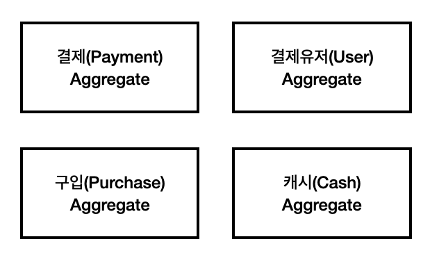

# Payment System with DDD

## Project Settings

### 1. Module Guide

본 프로젝트는 CQRS 패턴을 이용하여 구현되어 있다. 이에 따라 gradle을 이용하여 모듈이 둘로 나뉘어져 있는 디렉토리 구조를 확인할 수 있다. 서비스를 위해서는 `payment-command` 모듈과 `payment-query` 모듈을 각각 실행해야 한다.

#### payment-command 모듈

CRUD 중에서 CUD 만을 담당하는 모듈이다. 본인의 테이블에 DB를 저장하며, 해당 이벤트를 Kafka에 발행하여 Query 모듈에 알려준다. DDD의 핵심 도메인들은 이곳에 구현이 된다.

#### payment-query 모듈

CRUD 중에서 R 만을 담당하는 모듈이다. payment-command에서 발행한 이벤트를 Kafka로부터 consume하여 본인의 DB를 업데이트 한다. 이 모듈은 DDD의 핵심 도메인 중심이 아닌, 클라이언트에게 필요한 정보를 제공한다. 위의 command
모듈과는 다르게 조회의 효율성, 클라이언트의 호출과 관련하여 조회에 유연하게 구성해야 한다.

### 2. Infra Used

```
1. MySQL 8.0.21 for Command
2. MySQL 8.0.21 for Query
3. Kafka(Zookeeper)
```

위의 인프라는 로컬 실행을 위해서 docker-compose를 이용하였다.

> :warning: m1 맥북의 경우 docker-compose.yaml 파일에서 platform 관련 주석을 해제하고 실행할 것

- CQRS에서 DB를 분리하는 방법은 여러가지가 있지만, 가장 보편적인(?) 방식인 물리 DB를 나누는 방식을 이용하였다.  
  command와 query 모듈은 각각 다른 DB를 보게된다.
- kafka의 경우 application.yaml에 특별한 설정 없이도 kafka에 자동으로 붙게 설정이 되어 있다.(autoconfigure 덕분에)  
  이외의 운영을 위한 상세 설정은 생략했다.

## Domain 소개

이 프로젝트에서는 '결제' 컨텍스트를 예시로하는 간단한 DDD 프로젝트다.

1. 유저는 결제창에서 결제를 진행하여, 본인의 계정에 서비스 전용 재화(캐시)를 획득하게 된다. 게임이나 스타벅스 앱의 페이와 같이 충전과 관련된 시스템 대부분의 유형을 따르면 된다.
2. 결제는 결제 대행사를 이용해서 처리하기 때문에 결제창에서 유저가 결제를 완료하면 본 도메인에서 제공하는 api로 결제 금액 정보가 담긴 결제 완료 요청을 보낸다. 결제창은 웹의 영역이므로 해당 도메인에서 다루지 않아도 무방하다.
3. 서비스에는 특정 아이템이 있으며, 서비스 전용 재화를 이용해서 구매할 수 있다.(게임이라면 아이템, 스타벅스라면 구매한 식음료) 다만 아이템은 본 컨텍스트에서는 관리하지 않는다.

도메인은 대략 다음과 같은 구조를 따른다.

1. User: 유저는 캐시를 소유할 수 있어 내부 엔터티로 구현. 유저 계정 관리 서비스가 따로 있다고 가정한다. 여기에서는 자체적으로 생성한다.
2. Payment: 캐시를 획득하는 행위
3. Cash: Payment로부터 생성된 User에게 할당되는 Cash
4. Purchase: 캐시를 사용하는 행위. 캐시를 차감한다.



## Use Case

### i. Command

- 외부 결제 시스템 결제로 인한 캐시 증가

```
1. 해당 유저 아이디가 없을 경우 DB에 추가(계정은 다른 서비스에서 관리한다고 가정)
2. 유저 잔액 업데이트
2. 결제 기록 추가
3. 해당 이벤트를 consumer로 publish
```

- 각종 이유(구매 등)에 대한 캐시 사용

```
1. 유저의 잔액 확인
2. 유저의 잔액 차감
3. 구매 기록 저장
3. 해당 이벤트를 consumer로 publish
```

### ii. Query

- 유저의 결제 내역 조회
- 유저의 사용 내역 조회

#### Query Model의 모듈 특징

- Query 모델에서는 Consuming과 동시에 Query 모델에서 필요한 데이터로 가공한다고 가정한다.
- 그러므로 몇 가지 요소가 생략될 수 있다.
    - Repository가 Controller에 직접 주입될 수 있다. 왜냐하면 DB 쿼리 외의 별다른 로직이 필요없기 때문이다.
    - 마찬가지 이유로 Response DTO도 사용하지 않는다. 이미 DB에 저장된 모든 정보가 Response에 최적화 시켜져 있기 때문이다.


